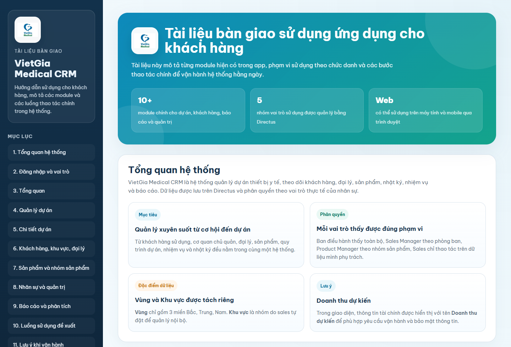
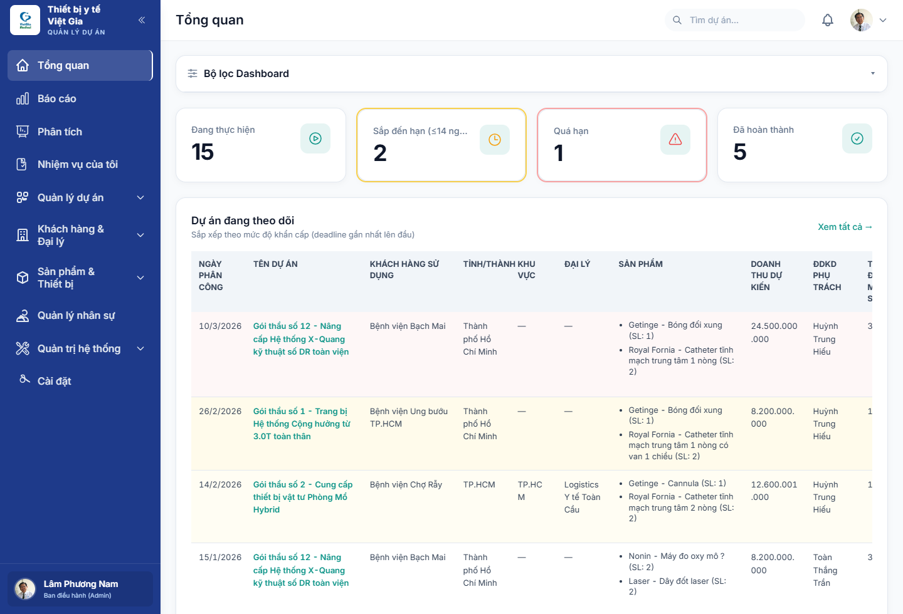
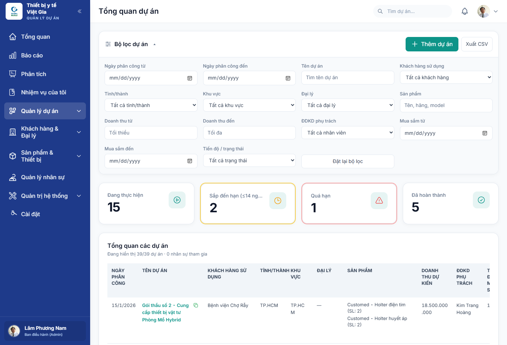
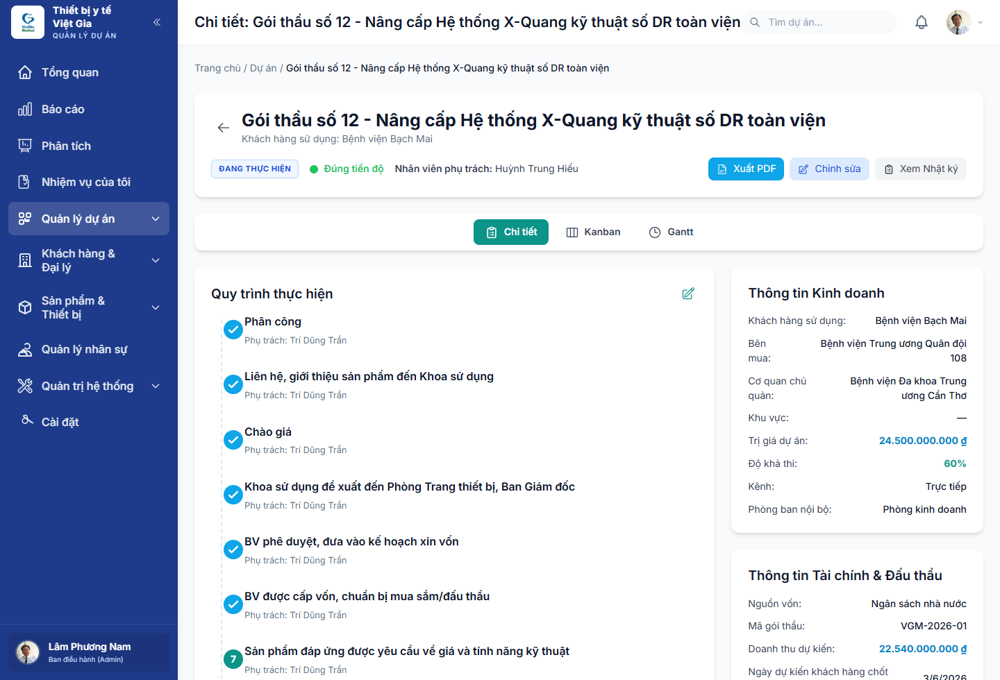
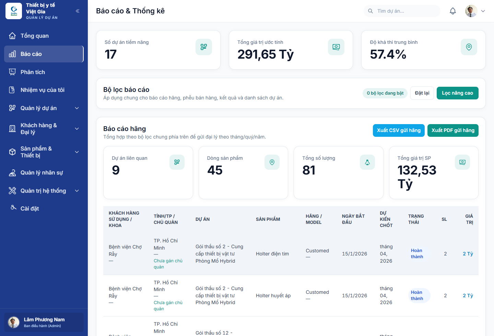
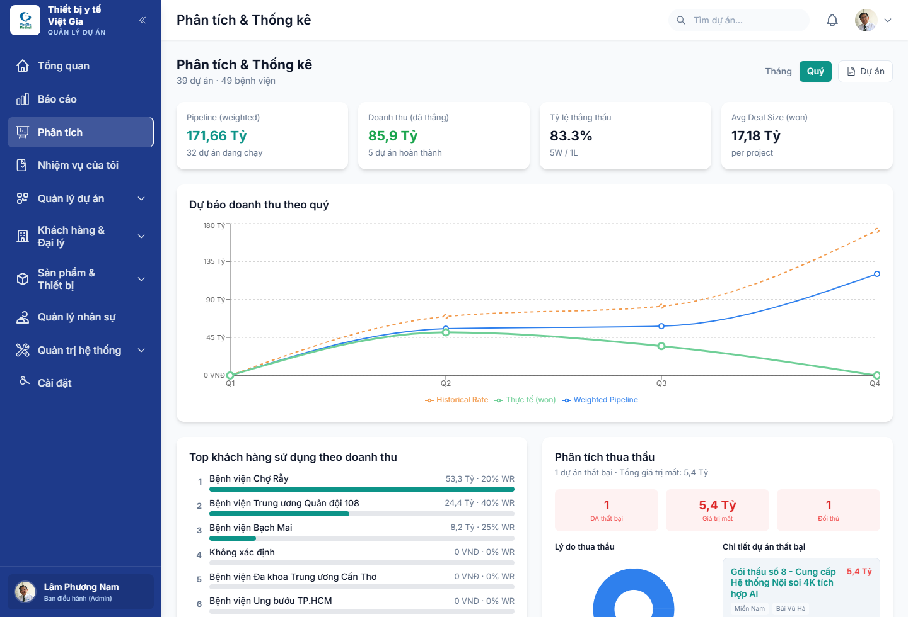
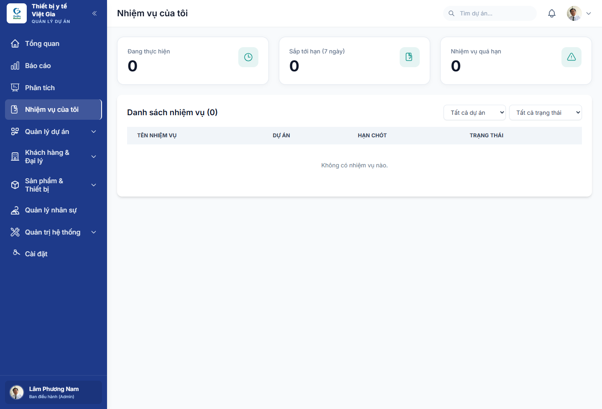
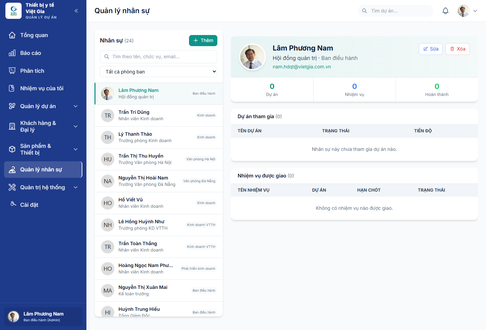
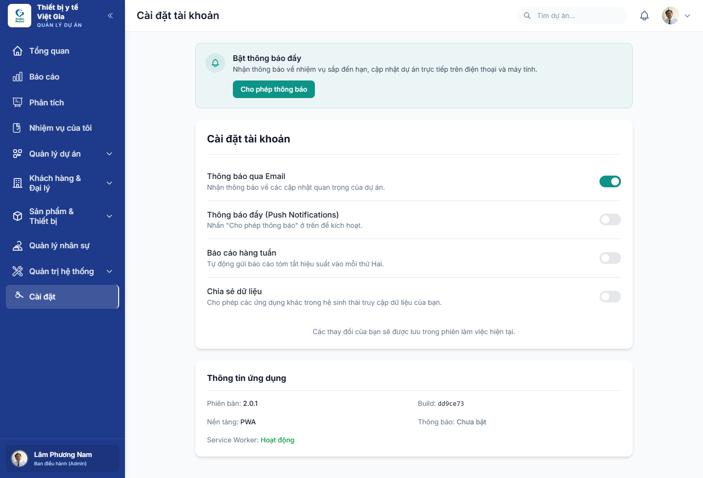

# VietGia Medical ERP

  

  <strong>An internal medical-sales execution system for tracking projects, tasks, tender progress, and operational visibility in one place.</strong>

  VietGia Medical ERP helps leadership and sales teams follow hospital opportunities, assigned work,
  products, dealers, reporting, and bidding milestones through one role-aware operating system.

  
  
  
  

  <strong>Read in English</strong> |
  <a href="README.vi.md"><strong>Đọc bằng tiếng Việt</strong></a>

  <a href="https://viet-gia-medical-guideline.vercel.app/"><strong>Guideline Site</strong></a>
  |
  <a href="SUPPORT.md"><strong>Support</strong></a>
  |
  <a href="docs/FAQ.md"><strong>FAQ</strong></a>
  |
  <a href="docs/ROADMAP.md"><strong>Roadmap</strong></a>

## The Big Shift

Many medical-device sales teams still operate with fragmented follow-up:

- Project status lives in spreadsheets.
- Tender milestones are tracked manually.
- Products, dealers, and hospitals are disconnected across tabs and messages.
- Task ownership becomes unclear once execution gets busy.
- Management sees updates late instead of seeing the pipeline live.

VietGia Medical ERP changes that operating model.

It brings projects, tender workflow, customer context, product mapping, personnel assignment, and management reporting into one internal system.

The "wow" is not just better data storage.  
The "wow" is that sales execution becomes visible, structured, role-aware, and measurable.

> From scattered deal follow-up to a controlled operating system for medical-sales execution.

## Why It Feels Enterprise-Ready

- Project, People, Product, and Tender Signals Live In One Place.
- Role-Based Access Shapes What Each User Can See And Edit.
- Dashboard, Reports, And Analytics Reflect Active Execution Rather Than Static Archives.
- The Project Detail View Goes Beyond Basic CRM Into Tender Stages, Financial Context, And Follow-Up Tasks.

## What You Get

- `Project Control Layer` for project list, project detail, and progress tracking.
- `Tender Tracking Layer` for procurement stages, expected purchase timing, and execution steps.
- `Task Layer` for assignment clarity and follow-up visibility.
- `Commercial Context Layer` for hospitals, dealers, products, and product groups.
- `Management Visibility Layer` for reporting, analytics, personnel, and governance.

## At A Glance

- Hosted Internal Web ERP.
- Role-Aware Access Model.
- Sales And Project Tracking.
- Tender And Procurement Pipeline Visibility.
- Reporting And Analytics.
- Personnel And System Administration.

## Visual Tour

  
  
  

  
  
  

  
  

## Core Product Areas

### 1. Dashboard

The dashboard gives management a quick operating pulse:

- Active Projects.
- Near-Deadline And Overdue Work.
- Completed Projects.
- Priority Items That Need Attention.

### 2. Project Management

Project tracking includes:

- Filterable Project Lists.
- Assignment Dates.
- Customer And Dealer Context.
- Product Mapping.
- Expected Revenue.
- Sales Owner.
- Purchase Timing.
- Progress And Status.

### 3. Project Detail And Tender Flow

The project detail surface goes deeper into real execution:

- Staged Tender Or Procurement Process.
- Assigned Owner.
- Tasks.
- Commercial Details.
- Financial And Bidding Information.
- Related Products.
- Notes And Timeline Context.

### 4. Reports And Analytics

Management reporting includes:

- Potential Project Counts.
- Estimated Value.
- Average Feasibility.
- Vendor Or Brand Reporting.
- Weighted Pipeline.
- Won Revenue.
- Win Rate.
- Lost-Bid Analysis.
- Customer And Regional Performance.

### 5. Task And Personnel Visibility

The system also supports:

- My Tasks Tracking.
- Personnel Management.
- Department-Level Views.
- Role-Sensitive Access.
- Settings And System Administration.

## Business Fit

This product is best understood as an internal ERP and CRM hybrid for medical-device commercial execution.

It fits organizations that need:

- Better Control Over Project Follow-Up.
- Visibility Into Tender Progress.
- Tighter Coordination Between Sales, Product, And Leadership.
- More Structured Reporting On Pipeline And Outcomes.

## Why It Exists

VietGia Medical ERP solves a practical internal problem:

> "A medical-device company needs to track project progress, tender stages, products, personnel, and expected revenue without losing control in spreadsheets and ad hoc follow-up."

That is why the product feels closer to an operating system for bidding execution than a simple CRM.

## Why People Remember It

- It Makes The Tender Pipeline Visible.
- It Connects Product Lines And Commercial Value Directly To Projects.
- It Supports Both Daily Sales Follow-Up And Management Reporting.
- It Feels Purpose-Built For Medical-Device Project Operations.

## Product Boundaries

### Included In The Current Product Shape

- Dashboard.
- Reports.
- Analytics.
- Task Management.
- Project List And Project Detail.
- Customer, Dealer, And Product Context.
- Personnel Management.
- Settings And System Administration.

### Important Caveats

- This Repository Is Not The Application Source Repository.
- The Live App Is An Internal Business System, Not A Public Self-Service SaaS Product.
- Access Scope And Data Visibility Depend On Configured Permissions.
- Some Administration Surfaces Are Only Appropriate For Authorized Internal Users.

## Public References

- Guideline / Handover Site: https://viet-gia-medical-guideline.vercel.app/
- Live ERP Login: https://vietgiamedical.alphabot.vn/

## 3-Step Getting Started

1. **Read** the public guideline site to understand the modules and intended operating flow.
2. **Review** the screenshots here to understand the real working surfaces.
3. **Coordinate** internally with the deployment owner or system admin for access and usage guidance.

## Start Here

- `Guideline Site`: https://viet-gia-medical-guideline.vercel.app/
- `Live ERP`: https://vietgiamedical.alphabot.vn/
- `Support`: [SUPPORT.md](SUPPORT.md)
- `FAQ`: [docs/FAQ.md](docs/FAQ.md)
- `Roadmap`: [docs/ROADMAP.md](docs/ROADMAP.md)

## Support

Support for this system should be routed through the internal deployment owner or an authorized system administrator.

This repository intentionally does not publish internal support credentials.

## Explore VietGia Medical ERP

  <strong>Want to see how projects, tender progress, personnel, and reporting can be managed in one medical-sales operating system?</strong> 
  Start with the guideline site, then review the live-surface screenshots published in this repository.

  <a href="https://viet-gia-medical-guideline.vercel.app/"><strong>Open Guideline Site</strong></a>
  |
  <a href="docs/FAQ.md"><strong>Explore FAQ</strong></a>

## Closed-Source Notice

VietGia Medical ERP is a closed-source internal business product.

This repository exists to:

- Explain The System.
- Summarize Product Scope.
- Publish Screenshots And Public-Facing Documentation.
- Provide A Controlled Overview Of The Product Shape.

It does not include:

- Application Source Code.
- Internal Credentials.
- Production Data.
- Private Business Records.
- Infrastructure Secrets.

## Repository Scope

This repo should stay limited to public-facing material:

- Product Overview.
- Screenshots.
- FAQ.
- Privacy Summary.
- Roadmap.
- Support And Security Guidance.
